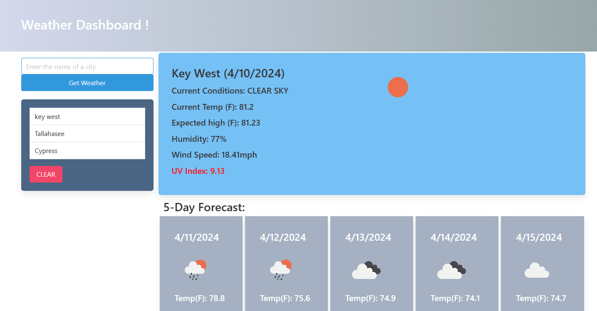

# Challenge6_Weather Dashboard | Eloy Garza

## Description
A web-app for checking the current weather and 5-day forecast for a city.

The link to my deployed github portfolio is: https://egarza0614.github.io/C6_Weather

## Usage
WHEN I search for a city
THEN I am presented with current and future conditions for that city and that city is added to the search history

WHEN I view current weather conditions for that city
THEN I am presented with the city name, the date, an icon representation of weather conditions, the temperature, the humidity, the wind speed, and the UV index

WHEN I view the UV index
THEN I am presented with a color that indicates whether the conditions are favorable, moderate, or severe

WHEN I view future weather conditions for that city
THEN I am presented with a 5-day forecast that displays the date, an icon representation of weather conditions, the temperature, and the humidity

WHEN I click on a city in the search history
THEN I am again presented with current and future conditions for that city

WHEN I open the weather dashboard
THEN I am presented with the last searched city forecast

## Technologies Used
    - HTML
    - Bulma CSS Framework
    - JavaScript
    - localStorage API
    * Weather information is provided by the OpenWeather [OpenWeatherMap API](https://openweathermap.org/). [Documentation](https://openweathermap.org/api) can be found here.

## Mock-Up

The following image shows the web application's appearance:

## License

[MIT © Eloy Garza](../LICENSE)
